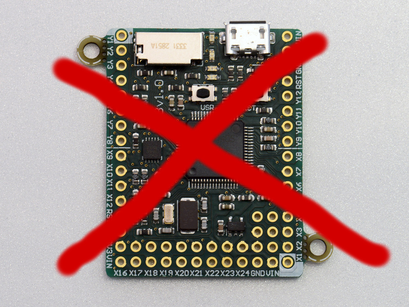
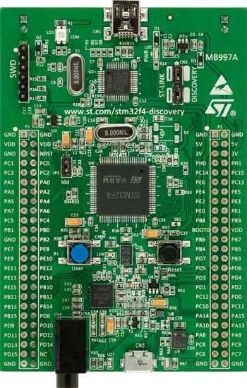
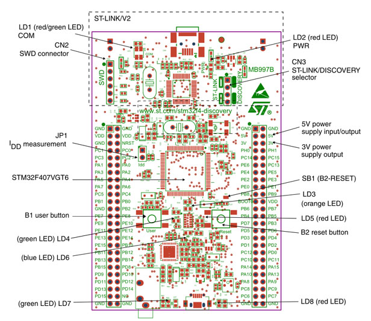

# Python-in-a-box für €15
## MicroPython auf dem STM32F4-Discovery Board

> https://github.com/SpotlightKid/micropython-stm.git

# MicroPython

## Python for microcontrollers

> "Micro Python is a lean and fast implementation of the Python 3 programming language that is optimised to run on a microcontroller. The Micro Python board is a small electronic circuit board that runs the Micro Python language."

# http://micropython.org/

# https://github.com/micropython

# http://forum.micropython.org/

# Pyboard



# STM32F4DISCOVERY Evaluation Board



# Features

* STM32F407 ARM Cortex M4 Prozessor mit FPU
* 168 Mhz
* ST-Link Programmer
* USB-OTG
* Accelerometer
* Audio-CODEC
* Spottbillig

# Anschlüsse und Pins



# Benötigte Hardware

* STM32F4DISCOVERY Evaluation Board (Mouser ca. €14 + Mwst.)
* USB-Kabel Typ-A Stecker auf Mini-B Stecker
* USB-Kabel Typ-A Stecker auf Micro-B Stecker
* (optional) 2x Jumper oder Jumper-Kabel female, female

# Benötigte Software

[GNU Tools for ARM Embedded Processors] [1] Binary-Tarball herunterladen und auspacken, z.B. in `$HOME/lib`:

```
$ wget https://launchpad.net/gcc-arm-embedded/4.9/4.9-2015-q1-update/+download/gcc-arm-none-eabi-4_9-2015q1-20150306-linux.tar.bz2
$ mkdir -p ~/lib; tar -xjf gcc-arm-none-eabi-*.tar.bz2 -C ~/lib
```

Binary-Pfad zur PATH-Environmentvariable hinzufügen:

```
$ export PATH="$HOME/lib/gcc-arm-none-eabi-4_9-2015-q1-update/bin:$PATH"
```

[1]: https://launchpad.net/gcc-arm-embedded

# Micro Python für STM32F4DISCOVERY kompilieren

Micro Python Git-Repository klonen:

```
git clone https://github.com/micropython/micropython.git
```

In das `micropython/stmhal`-Verzeichnis wechseln und `make` aufrufen:

```
$ cd micropython/stmhal
$ make BOARD=STM32F4DISC
```


# Micro Python für Unix kompilieren

```
$ cd ../unix
$ make
```

Ausführen:

``` 
$ ./micropython
Micro Python v1.4.1-17-g9988618 on 2015-04-08; linux version
>>> 
```


# Booten im DFU-Modus

* Pin **BOOT0** via Jumper-Kabel mit **5V** verbinden
* Pin **BOOT1** (=**PB2**) via Jumper(-Kabel) mit **GND** verbinden (evtl. nicht notwendig).
* Mini-USB-Port **CN1** zur Stromversorgung verbinden.
* Micro-USB-Port **CN5** mit USB-Port am Computer verbinden.
* **Reset**-Knopf drücken.

Siehe auch: [UM1467 User manual](http://www.st.com/st-web-ui/static/active/en/resource/technical/document/user_manual/DM00037368.pdf) (*Getting started with software and firmware environments for the STM32F4DISCOVERY Kit*), S. 9.

# MicroPython Firmware flashen

## Option 1: USB-DFU ([Device Firmware Update] [1])

Paket [`dfu-util`] [2] installieren (Arch Linux: `dfu-util-git` aus AUR).

```
$ lsusb
```

USB-ID von Gerät *STMicroelectronics STM Device in DFU Mode* notieren.

```
$ cd stmhal
$ make BOARD=STM32F4DISC DEVICE=0483:df11 V=1 deploy
```

Die Option `DEVICE` muss nur übergeben werden, falls sich die ermittelte USB-ID von der o.g. unterscheidet.

[1]: https://en.wikipedia.org/wiki/Device_Firmware_Update
[2]: http://wiki.openmoko.org/wiki/Dfu-util

# Option 2: ST-Link und GDB

* Paket [`stlink`] [1] installieren.
* Neues Terminal-Fenster öffnen und `st-util` starten:

      $ st-util

* `st-util` wartet auf eine Verbindung von GDB. Wiederrum im `micropython/stmhal`-Verzeichnis:

      $ arm-none-eabi-gdb build-STM32F4DISC/firmware.elf

* Am Prompt von GDB mit dem `st-util`-Server verbinden:

      (gdb) target extended localhost:4242

* Firmware flashen:

      (gdb) load


[1]: https://github.com/texane/stlink
